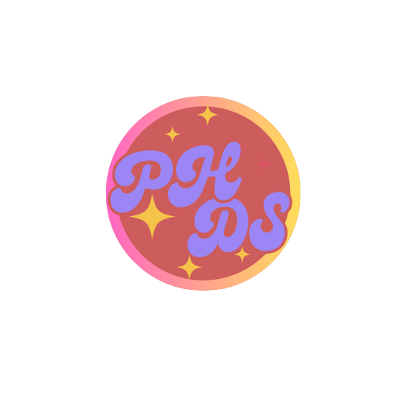

<a name="readme-top"/>

<br/>

<br />
<div align="center">
  <a href="https://github.com/Hermayni">


  </a>
  <h3 align="center">WD - Hero & Card</h3>
</div>
<div align="center">
 Portfolio of Heroes and Cards
</div>

<br />


---

<br />
<br />

<!-- TODO: If you want to add more layers for your readme -->
<details>
  <summary>Table of Contents</summary>
  <ol>
    <li>
      <a href="#overview">Overview</a>
      <ol>
        <li>
          <a href="#key-components">Key Components</a>
        </li>
        <li>
          <a href="#technology">Technology</a>
        </li>
      </ol>
    </li>
    <li>
      <a href="#rules-and-principles">Rules and Principles</a>
    </li>
    <li>
      <a href="#resources">Resources</a>
    </li>
  </ol>
</details>

---

## Overview

<!-- TODO: To be changed -->
Description of the project in details.

Guiding Question:

**What is the project**
   <br>
   The project involves creating a dynamic web page featuring a navigation menu with animated hero logos and a user interaction card. The navigation menu includes multiple hero logos that reveal additional text when hovered over. The user interaction card displays an invitation message with buttons for further actions.
   <br>
   <br>

**Whats the purpose**
<br>
The purpose of the project is to develop an engaging and interactive web interface that enhances user experience. The animated logos and interactive card aim to provide a visually appealing and user-friendly design that encourages interaction and exploration of the website.
<br>
<br>

**What are key component**

<br>
<ul>
<li>Header: Contains the navigation menu with hero logos.</li>
<li>Navigation Menu: Features animated logos that show additional text on hover.</li>
<li>User Interaction Card: Displays an invitation message with action buttons.</li>
<li>Logos: Represent different heroes and link to respective pages.</li>
<li>Buttons: Allow users to view the file or mark the invitation as read.</li>
</ul>
<br>
<br>

**What technology used and how it is used**

<br>
<ul>
<li>HTML: Structures the web page content and elements.</li>
<li>CSS: Styles the web page, including animations and responsive design.</li>
<li>Flexbox: Used for layout and alignment.</li>
<li>Animations: Applied to logos for hover effects.</li>
<li>Fonts: Integrated custom fonts for aesthetic appeal.</li>
<li>External Resources: Google Fonts for custom font integration.</li>
<br>


### Key Components
<!-- TODO: List of Key Components -->

<ul>
  <li>Headers</li>
  <li>Footers</li>
  <li>Content</li>
  <li>Styling</li>
  <li>Responsive Design</li>
  <li>Icons and Images</li>
</ul>


### Technology
<!-- TODO: List of Technology Used -->


## Rules and Principles
1. Always use ***WD-*** in the Title of the Project for the Subject
2. Do not rename any .html files; always use 'index.html' as the filename.
3. File Structure to follow

```
WD-ProjectName
└─ assets
|   └─ css
|   |   └─ style.css
|   └─ js
|   |   └─ script.js
|   └─ img
|       └─ fileWith.jpeg/.jpg/.webp/.png
└─ pages
|  └─ pageName
|     └─ index.html
|     └─ assets
|        └─ css
|        |  └─ style.css
|        └─ js
|        |  └─ script.js
|        └─ img
|           └─ fileWith.jpeg/.jpg/.webp/.png
└─ index.html
└─ readme.md
```

## Resources


| Title | Purpose | Link |
|-|-|-|
| Easy Flipcard Tutorial HTML & CSS | served as a guide in making cards | https://youtu.be/NCLdf661ILE?si=NV4es3Dwf4OF3QCd|
| Design The Perfect Hero Section (With Example)| served as a guide in making hero pages |https://youtu.be/LJbkLdtEW00?si=SNUHH-54NvHaIlPn|
|Responsive Card UI Design With Hover Animation Effects Using HTML CSS Only Keyframe Effects| served as a guide in making  cards|https://youtu.be/VmzNL6CsyvA?si=oOSVdlVGkqSNidQ-|
| Create a Simple CSS Card using HTML and CSS| served as a guide in making card| https://youtu.be/JJadIs83k3s?si=sxPjGufKXyPpmn4w|
|Image resources | all used images are saved here | https://ph.pinterest.com/hermayni22/hands-on-2/
|How To Create A Website using HTML & CSS Step-by-Step Tutorial| served as a guide in making the website | https://youtu.be/CQZxeoQeo5c?si=koF21GHSWwC0Xu4Z|
|Google Fonts | Font Library | https://fonts.google.com/|

